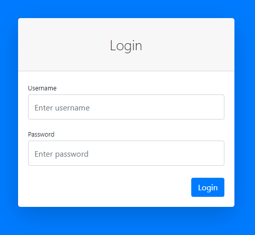
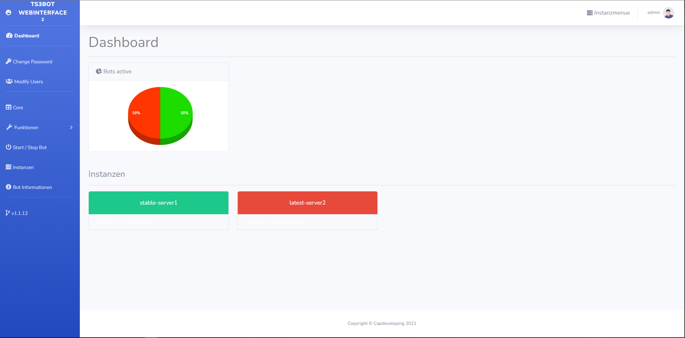
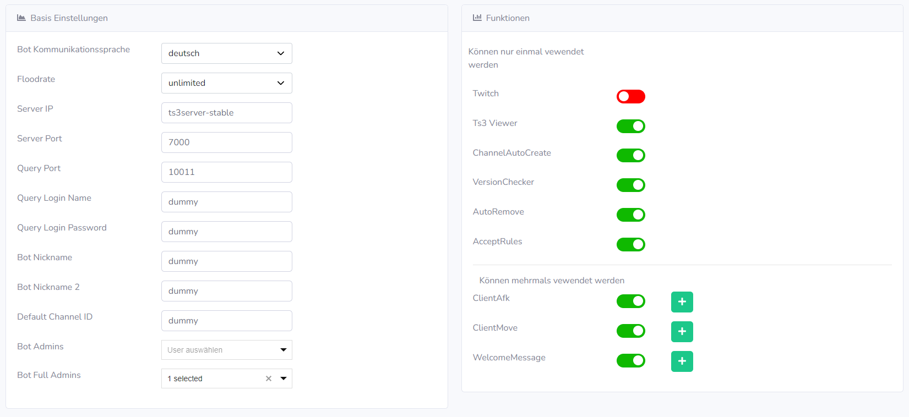
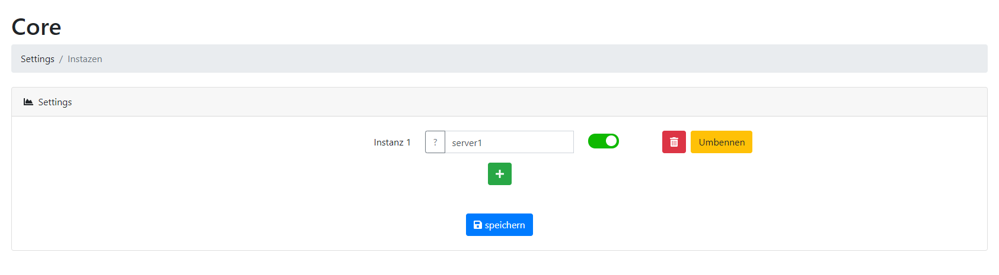

# Teamspeak 3 Bot

Dieser Bot kann frei verwendet werden.

# Demo
https://demo-ts3bot.capdeveloping.de

Login

Benutzername: admin

Passwort: demo

# Funktionen

## Können mehrmals in der Config verwendet werden 
_______________________
#### ClientMove
#### ClientAFK
#### WelcomeMessage
_______________________
## Kann nur einmal verwendet werden
_______________________
#### Ts3Viewer
#### ChannelAutoCreate
#### VersionChecker
#### AutoRemove
#### AcceptRules
#### Twitch

# Screenshots
#### Login Page

Default login Daten

Benutzername: admin

Passwort: password



#### Dashboard


#### Core Settings


#### Instanzen verwalten


# docker-compose
## for teamspeak server as container on same host
## Ich empfehle erstmal mit einem Basic Auth zu arbeiten.
```
version: "2"

services:
ts3bot:
  image: ts3bot:latest
  container_name: ts3bot
  restart: always
  ports:
    - 8080:80
  networks:
    front:
      ipv4_address: specific ip for whitelist
  volumes:
     - /path/to/folder/ts3bot/configs:/data/configs
     - /path/to/folder/ts3bot/db.sqlite3:/data/db.sqlite3

networks:
 front:
     external:
         name: ts3server
```

## for teamspeak server on different host
```
version: "2"

services:
 ts3bot:
   image: ts3bot:latest
   container_name: ts3bot
   ports:
     - 8080:80
   restart: always
   volumes:
     - /path/to/folder/ts3bot/configs:/data/configs
     - /path/to/folder/ts3bot/db.sqlite3:/data/db.sqlite3
```